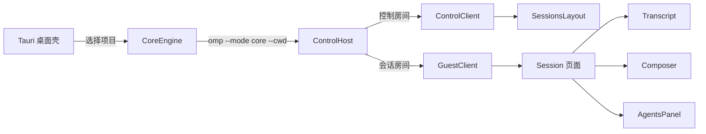

# Oh My Pi Codex 风格桌面客户端第二轮改造计划

## 1. 文档目的

本计划以 2026-08-12 的当前源码和实际运行界面为基线，继续收敛 Oh My Pi 桌面客户端与 Codex 桌面端之间的界面差距，并优先修复两个已经影响使用的基础问题：

1. 会话中的图片只能查看，无法复制到系统剪贴板。
2. Windows 项目路径在 `//?/D:/...`、`D:/...` 和反斜杠形式之间混用，导致左侧项目重复、路径暴露和视觉噪声。

当前代码已经完成第一轮 Codex 风格改造，包括双栏应用外壳、项目与会话侧栏、会话正文、底部 Composer、设置页、模型与推理强度控制、子代理面板和响应式布局。本轮从这些已落地能力继续开发，不重新搭建外壳，也不回退现有真实功能。

## 2. 调研输入

### 2.1 参考资料

- 用户提供的当前 Oh My Pi 客户端截图。
- `UI/1.png`：Codex 会话主界面。
- `UI/2.png`：Composer 的添加菜单。
- `UI/3.png`：Composer 的模型与推理选项菜单。
- 当前 `packages/collab-web` 和 `packages/tauri-shell` 源码。
- 当前 `docs/codex-style-desktop-ui-plan.md` 的第一轮方案及其已落地内容。
- Tauri 2 Clipboard Manager 官方接口与权限模型。
- 浏览器 Async Clipboard API 的图片写入能力与安全上下文限制。

### 2.2 实际运行基线

使用 `packages/collab-web/scripts/mock-host.ts` 启动真实 WebSocket 会话后，当前会话页已确认具备以下结构：

- 50px 左右的扁平顶栏。
- 用户气泡、助手正文、折叠工具卡和系统标记。
- 760px 宽、112px 高的底部 Composer。
- Composer 中常驻工作区、推理强度和模型控件。
- 子代理入口、参与者、上下文百分比和连接状态集中在顶栏。

当前结构已经接近 Codex 的会话骨架，但仍有以下明显差距：

- 顶栏状态过密，标题、路径、推理强度、上下文、参与者、连接、设置和子代理同时常驻。
- Composer 底部控制行直接展示工作区完整路径，并混用原生 `<select>` 与自定义模型菜单。
- 左栏项目行常驻显示完整路径，参考界面只把项目名作为主要信息。
- 消息图片是裸 ``，工具图片只有“在新窗口打开”，没有统一的内容操作层。
- 图片、文本回复和工具结果没有一致的 hover/focus 操作区。
- 当前第一轮计划中的 288px 左栏和 760px 内容列比参考图更宽，主区显得松散。

## 3. 当前架构

### 3.1 运行链路



- `packages/tauri-shell` 负责项目目录、最近项目、窗口生命周期和 core 子进程。
- `packages/collab-web` 同时服务 Tauri WebView 和普通浏览器。
- `SessionSummary.cwd` 与 `SessionState.cwd` 来自 coding-agent 会话。
- 消息图片与工具结果图片已经通过 wire 传输为 Base64 数据和 MIME 类型。
- Tauri 页面运行在 core 提供的随机 `http://127.0.0.1:<port>` 地址上，通过受限 remote capability 调用桌面命令。

### 3.2 本轮可直接复用的真实能力

|能力|当前来源|本轮处理|
|---|---|---|
|项目打开、切换、最近项目|Tauri project commands|保留行为，修复外部路径表示|
|会话新建、恢复、删除|ControlClient|保留行为，重做视觉密度|
|消息与工具结果图片|`ImageContent` / `ToolResultImage`|增加统一查看与复制操作|
|模型选择|`model-list` / `model-change`|移入 Composer 统一选项菜单|
|推理强度选择|`availableThinkingLevels` / `thinking-change`|移入 Composer 统一选项菜单|
|只读与连接状态|GuestSnapshot|降低常驻视觉权重，保持可访问|
|上下文用量与参与者|GuestSnapshot|移入会话详情弹层或低权重入口|
|子代理|现有 Agent 面板与抽屉|保留真实操作，不伪造 Codex 来源面板|
|主题|本地设置|保留 System、Light、Dark|

## 4. 根因结论

### 4.1 Windows 路径混乱

路径问题来自同一个项目跨越 Tauri 与 coding-agent 边界时使用了两种合法表示。

当前数据流如下：

```mermaid
flowchart TD
    A[文件夹选择器 D:\project\oh-my-pi] --> B[Path::canonicalize]
    B --> C[内部路径 \\?\D:\project\oh-my-pi]
    C --> D[ShellConfig recent_projects]
    C --> E[project_list current_project]
    E --> F[前端替换反斜杠]
    F --> G[//?/D:/project/oh-my-pi]
    C --> H[project_dir_for_cli]
    H --> I[--cwd D:\project\oh-my-pi]
    I --> J[SessionSummary.cwd D:/project/oh-my-pi]
```

具体问题：

1. `packages/tauri-shell/src/project.rs#switch_project()` 对所选目录调用 `canonicalize()`。
2. Windows 返回的 canonical path 可能带 `\\?\` 扩展长度前缀。
3. 该 canonical 字符串被直接写入 `ShellConfig`，并通过 `project_list` 返回给前端。
4. `packages/tauri-shell/src/core_engine.rs#project_dir_for_cli()` 已经只在 CLI 边界移除了该前缀，因此会话上报的是普通 `D:/...`。
5. `packages/collab-web/src/components/sessions/SessionsPanel.tsx#normalizeProjectPath()` 只统一斜杠、重复分隔符和末尾斜杠，没有识别 `//?/`、`//?/UNC/` 或 `\\?\UNC\`。
6. 同一个目录因此可以拥有两个不同的比较键，并在侧栏形成重复项目或同时显示 `//?/...` 与 `D:/...`。
7. `shortenPath()` 只按 `/` 切分，也没有处理 Windows 扩展路径和反斜杠。

修复原则：

- canonical path 继续保留在 `CoreEngine` 内部，用于精确身份比较和 `current_dir`。
- 所有离开 Tauri 内部边界的路径必须转换为普通 Win32/UNC 表示。
- 前端仍保留防御性规范化，兼容旧配置、历史会话和非 Tauri 宿主。
- 界面主要显示项目名；完整路径只进入 tooltip、设置详情和需要诊断的次级区域。

### 4.2 图片无法复制

图片问题来自渲染层没有建立图片对象操作契约。

当前有两条图片渲染路径：

1. `Transcript.tsx#MsgContent()` 直接渲染裸 ``。
2. `tool-render/parts.tsx#ResultImages()` 用按钮包裹 ``，点击后只通过 Blob URL 打开新窗口。

两条路径均缺少：

- 系统剪贴板写入能力。
- Copy 按钮与键盘入口。
- copying、copied、failed 状态。
- 能力不可用时的明确禁用状态。
- 消息图片和工具结果图片之间的共享操作契约。

数据层已经完整：图片包含 Base64 数据和 MIME 类型。本问题不需要修改 `@oh-my-pi/pi-wire` 或会话协议。

桌面与浏览器的能力边界不同：

- Tauri 桌面端应使用 Clipboard Manager 的 `writeImage()`，并只授权图片写入。
- 浏览器端可在安全上下文中使用 `navigator.clipboard.write()` 与 `ClipboardItem`。
- 浏览器通常可靠支持写入 PNG；JPEG、WebP、GIF 等输入应先在前端转换为 PNG。
- 能力不可用或权限拒绝时，应显示失败反馈，不得静默假装成功，也不得把 Base64 文本当图片复制。

## 5. 产品与工程决策

### 5.1 保留当前能力边界

本轮不修改：

- `packages/agent` 的代理循环。
- `packages/ai` 的模型调用和认证。
- 会话 JSONL 格式。
- `COLLAB_PROTO` 和现有 wire 帧。
- 工具执行行为。
- TUI。

### 5.2 不伪造参考界面功能

参考图中的以下入口没有对应的 OMP 数据源或动作，本轮不实现：

- Codex 品牌、账户、订阅和额度。
- “拉取请求”“站点”“已安排”“插件”等 Codex 产品导航。
- 右上角“输出/来源”面板及 codegraph、网页搜索来源列表。
- 点赞、点踩、重新生成等反馈动作。
- 麦克风、速度档位和权限档位。
- Composer 的附件菜单；现有 guest Composer 尚未形成完整的文件选择、图片编码、预览、删除和发送契约。

现有子代理面板继续代表 OMP 自身能力，不伪装成 Codex 的来源面板。

### 5.3 先修数据身份，再改视觉

路径身份与图片能力必须先完成，原因如下：

- 侧栏视觉重做不能建立在重复项目组之上。
- 图片操作按钮不能在消息与工具结果中各自实现一套不一致逻辑。
- Tauri capability、浏览器 fallback 和 UI 状态需要先形成单一契约。

### 5.4 共享实现，不复制逻辑

- Windows 扩展路径前缀识别复用 `@oh-my-pi/pi-utils` 已有的 `stripWindowsExtendedLengthPathPrefix()`；浏览器调用时显式传入 `"win32"`，只进行结构化前缀处理。
- Tauri Rust 侧抽取一个共享的外部路径转换函数，同时供 CLI 参数、配置持久化和 `project_list` 使用。
- 图片 Base64 解码、PNG 规范化和 clipboard 写入集中在一个前端模块。
- 工具渲染器通过 `ToolRenderHost` 可选能力调用宿主，不直接依赖 Tauri。

## 6. 目标界面规范

### 6.1 整体框架

- 默认左栏宽度调整为 248px，允许范围 240–264px。
- 主区保留近白背景和单条发丝分隔线。
- 会话顶栏高度固定为 48px。
- 会话正文与 Composer 使用同一中心线，最大宽度 720px。
- 宽工具输出可占满 720px，不因正文宽度被进一步压缩。
- 子代理面板保持 360–400px；可用宽度不足时使用 overlay。
- Light 主题作为视觉对照；System 仍为默认偏好。

### 6.2 左侧项目与会话导航

参考 Codex 左栏的信息优先级：产品动作、项目名、会话标题。路径不作为常驻正文。

目标结构：

1. Oh My Pi 标识与低权重连接状态。
2. “新会话”动作。
3. “项目”分组。
4. 项目名及其会话列表。
5. 底部设置与离开。

项目行：

- 单行展示 folder icon、项目 basename 和展开箭头。
- 不显示 `.sh-project-path` 常驻次级行。
- 完整普通路径放入 `title`，并在设置页显示。
- 当前项目依靠字重或极浅背景区分，避免和当前会话竞争。
- 同一项目的扩展路径、普通路径、斜杠变体和大小写变体只产生一个项目组。
- 项目切换中的 pending 文案只替换项目名，不改变行宽。

会话行：

- 高度 34–36px。
- 当前会话使用稳定的中性选中背景。
- 相对时间默认隐藏，hover/focus 或足够宽时显示；会话标题保持优先。
- streaming 与 error 使用 6px 状态点。
- 删除动作只在 hover/focus 中出现。

### 6.3 会话顶栏

左侧只保留：

- control 模式返回按钮。
- 会话标题。
- 可选的 folder icon；完整工作区路径只进入 tooltip。

右侧只保留：

- 连接状态点。
- 会话详情入口。
- 设置入口。
- 子代理入口。

以下信息移出常驻顶栏：

- 推理强度。
- 上下文进度条。
- 参与者头像堆叠。
- 常驻 cwd 文本。

会话详情弹层展示真实只读信息：当前项目、完整路径、模型、推理强度、上下文用量、参与者和连接状态。该弹层只读，不伪装成设置表单。

### 6.4 Transcript 与消息操作

- 用户消息继续右对齐、使用浅色气泡。
- 助手消息继续无气泡、左对齐。
- 现有 Markdown、Thinking、系统标记、工具配对、stream ghost 和 tail follow 行为保持不变。
- 助手消息结束后可显示低权重操作行；首期只提供真实可执行的“复制文本”。
- 不显示无后端动作的点赞、点踩和重新生成。
- 操作行在 pointer hover、focus-within 或键盘导航时显示；触控设备保持可发现。
- 复制文本排除 Thinking 与工具参数，复制该助手消息中可见的文本块。

### 6.5 图片对象

消息图片与工具结果图片使用统一交互模型：

- 图片保留原始纵横比，最大高度 480px。
- 1px 中性边框、10px 圆角和中性背景。
- 点击图片打开大图预览，不直接触发复制。
- 图片右上角显示轻量操作条：复制、打开大图。
- pointer 设备在 hover/focus 时显示操作条；触控设备常驻显示。
- Copy 按钮具有 `aria-label="Copy image"`、title 和可见 focus ring。
- 复制过程中禁用重复点击。
- 成功后按钮短暂显示“Copied”或 check icon，并通过 `aria-live="polite"` 通知。
- 失败后显示“Copy failed”，保留再次尝试能力。
- 不支持图片剪贴板的平台显示禁用按钮及原因。
- 大图预览支持 Escape 关闭、外点关闭、focus return 和滚动锁定。

### 6.6 Composer

参考 `UI/3.png`，模型与推理强度整合为一个紧凑选项菜单。

Composer 主卡：

- 最大宽度 720px。
- 最小高度 104–112px。
- 20px 圆角、1px 边框和克制阴影。
- Textarea 保持无独立边框，最大 8 行。
- 底部控制行保持 32–36px。

左侧：

- 只显示 folder icon 与项目名。
- 不常驻显示完整 cwd。
- 不支持项目切换时使用普通 metadata，不渲染伪下拉。
- 完整路径通过 tooltip 或会话详情查看。

右侧：

- 单一“模型/推理设置”触发器，摘要显示当前模型和推理强度。
- 弹层按行显示“模型”和“推理强度”，点击后进入二级列表或展开子菜单。
- 不显示速度、权限、账户或其他无数据项。
- 保留 Send、Stop、Queued 和 Abort。

行为不得回归：

- Enter 发送。
- Shift+Enter 换行。
- IME composition guard。
- busy 时仍允许排队发送。
- read-only、waiting 和 ended 状态。
- Ask select、Ask editor 和 Cancel。
- 模型列表 loading、empty、selected 和 change。
- 推理强度的 available、configured、selected 和 change。

### 6.7 设置、连接和子代理

- 现有 General 与 Appearance 设置页继续保留。
- General 中的项目路径使用统一普通显示形式。
- 设置页、会话详情和 tooltip 必须使用同一个路径格式化函数。
- 子代理面板保留现有 chat、kill、revive 与 transcript polling。
- 连接、重连和结束状态维持现有真实动作。
- 不为视觉相似度移除 OMP 独有的真实能力。

### 6.8 响应式

- 大于 1100px：248px 常驻侧栏；子代理可并排。
- 901–1100px：侧栏保持；子代理改为 overlay。
- 900px 以下：侧栏改为最大 88vw 的 overlay。
- 720px 以下：主区 padding 16px，Composer 左右 12px，图片操作条常驻。
- 640px 以下：输入字号 16px，触控目标至少 44×44px。
- 480px 以下：模型/推理菜单宽度为 `calc(100vw - 24px)`，图片预览占满可用宽度。
- 高度 680px 以下：Composer 保留 safe area，菜单向上展开且不超出视口。

## 7. 技术设计

### 7.1 路径身份与显示

#### Rust 内部边界

新增 `packages/tauri-shell/src/project_path.rs`，集中提供：

```rust
pub(crate) fn project_path_for_external_use(path: &Path) -> PathBuf;
pub(crate) fn project_path_string_for_external_use(path: &Path) -> String;
```

契约：

- Windows `Prefix::VerbatimDisk` 转为普通盘符路径。
- Windows `Prefix::VerbatimUNC` 转为普通 UNC 路径。
- 普通 Windows 路径保持不变。
- 非 Windows 路径保持不变。
- 不解析不存在路径，不重新 canonicalize。

使用点：

- `CoreEngine::start()` 的 `--cwd` 参数。
- `ShellConfig.last_project` 与 `recent_projects` 的持久化值。
- `project_list.current_project`。
- 最近项目菜单 id 与 tooltip。

`CoreEngine.project_dir` 继续保存 canonical path，不改变内部项目身份比较。

旧配置迁移：

- `load_config()` 后规范化 `last_project` 和每个 recent project。
- 以 Windows 不区分大小写的普通路径键去重。
- 保持最近顺序，最多 8 项。
- 如果迁移改变了配置，启动阶段回写一次。
- 不存在路径仍可保留在历史列表；是否存在继续由打开或恢复时验证。

#### 前端防御层

新增 `packages/collab-web/src/lib/workspace-path.ts`：

```ts
export interface WorkspacePath {
  raw: string;
  normalized: string;
  comparisonKey: string;
  name: string;
  display: string;
}

export function parseWorkspacePath(raw: string): WorkspacePath;
export function workspacePathKey(raw: string): string;
export function workspaceName(raw: string): string;
export function displayWorkspacePath(raw: string): string;
```

规范化顺序：

1. trim。
2. 通过 `stripWindowsExtendedLengthPathPrefix(raw, "win32")` 结构化移除扩展前缀。
3. 将反斜杠转换为 `/`。
4. 保留普通 UNC 的起始 `//`。
5. 压缩重复分隔符。
6. 去除非根路径末尾分隔符。
7. Windows drive 与 UNC 的 comparison key 转小写。
8. POSIX 路径保持大小写敏感。

展示规则：

- 左栏与 Composer 只使用 `name`。
- tooltip 与设置使用 `display`。
- Windows display 使用普通盘符或 UNC，不出现 `//?/`。
- 分组、折叠状态、当前项目比较和 desktop project 映射全部使用 `comparisonKey`。

### 7.2 剪贴板桥接

新增 `packages/collab-web/src/lib/image-clipboard.ts`：

```ts
export interface ClipboardImage {
  data: string;
  mimeType: string;
}

export interface ImageClipboard {
  readonly available: boolean;
  copy(image: ClipboardImage): Promise<void>;
}
```

内部职责：

1. 校验 MIME 必须为 `image/*`。
2. 将 Base64 解码为二进制，不生成长期 data URL 缓存。
3. PNG 输入直接复用字节。
4. 非 PNG 输入通过浏览器解码与 canvas 转换为 PNG。
5. Tauri 环境优先调用 Clipboard Manager。
6. 普通浏览器在 secure context 且 `ClipboardItem` 可用时调用 Async Clipboard API。
7. 无能力或权限失败时抛出可展示错误。
8. 每次复制后释放 Blob URL、canvas bitmap 和 Tauri Image resource。

Tauri 集成：

- `packages/tauri-shell/Cargo.toml` 增加 `tauri-plugin-clipboard-manager = "2"`。
- `packages/tauri-shell/src/main.rs` 初始化 clipboard manager plugin。
- `packages/tauri-shell/src/capabilities/default.json` 只增加 `clipboard-manager:allow-write-image`。
- remote capability 继续限制在 `http://127.0.0.1:*` 与主窗口。
- 不授权 clipboard read、text write、HTML write 或 clear。
- `packages/collab-web/package.json` 增加匹配 Tauri 2 的 `@tauri-apps/api` 与 `@tauri-apps/plugin-clipboard-manager`。

图片统一转 PNG 后再写入，原因：

- 浏览器图片剪贴板对 PNG 支持最稳定。
- Tauri `Image.fromBytes()` 在当前启用的 `image-png` feature 下可以从 PNG 字节创建资源。
- 可以为 JPEG、WebP 和静态 GIF 提供一致结果。

### 7.3 图片组件与工具宿主

新增 `packages/collab-web/src/components/transcript/ImageAttachment.tsx`：

- 接收 `ClipboardImage`、alt、variant 和可选操作能力。
- 负责大图预览、复制状态和无障碍反馈。
- 消息图片与自定义消息图片统一使用该组件。

扩展 `ToolRenderHost`：

```ts
export interface ToolRenderHost {
  hasAgent?(id: string): boolean;
  openAgent?(id: string): void;
  copyImage?(image: ToolResultImage): Promise<void>;
  openImage?(image: ToolResultImage): void;
}
```

- `Session` 创建的 `toolHost` 注入真实 image clipboard 与 preview 动作。
- `ResultImages()` 在 host 提供能力时显示 Copy。
- standalone HTML export 没有 host 时继续安全显示和打开图片，不假定 Tauri 存在。
- 修改共享 `tool-render` 后重新运行 `gen:tool-views` 并验证 HTML 导出。

### 7.4 消息复制

新增纯函数提取助手可见文本：

- 只拼接 `message.content` 中的 `text` block。
- 不包含 Thinking、toolCall、error metadata 或隐藏内容。
- 空文本不渲染 Copy 动作。
- 使用同一个反馈组件展示复制成功或失败。

浏览器与 Tauri 均可使用文本 Clipboard API；如果本轮只交付图片复制，可将文本复制留在同一组件接口中但不渲染，不能提交空动作。

### 7.5 Composer 选项菜单

新增 `ComposerOptionsMenu.tsx`，替换当前并排的原生 thinking `<select>` 与 `ModelPicker` 触发器。

组件状态：

- closed。
- root menu。
- model list loading/empty/ready。
- thinking list。
- disabled/read-only。

交互：

- 第一次进入模型列表时调用 `sendModelList()`。
- 模型与推理选择后返回 root 或关闭，行为必须一致。
- Escape 逐级返回；root Escape 关闭并归还 focus。
- 外点关闭。
- ArrowUp、ArrowDown、Home、End 和 Enter 支持菜单导航。
- 当前值使用 check icon 与 `aria-checked` 或 `aria-current`。
- 不使用原生 `<select>`，避免与自定义菜单视觉割裂。

## 8. 文件级实施计划

### 阶段 A：路径身份闭环

目标：同一 Windows 项目在所有桌面与 Web 边界上只有一个身份，并且界面不再显示扩展路径前缀。

修改：

- `packages/tauri-shell/src/project_path.rs`
  - 新增普通外部路径转换。
- `packages/tauri-shell/src/lib.rs`
  - 注册内部 path module。
- `packages/tauri-shell/src/core_engine.rs`
  - 删除私有 `project_dir_for_cli()` 重复实现，改用共享函数。
- `packages/tauri-shell/src/project.rs`
  - 持久化和 `project_list` 输出普通路径。
- `packages/tauri-shell/src/config.rs`
  - 迁移、去重旧路径。
- `packages/tauri-shell/tests/core_engine.rs`
  - 保留 canonical 内部路径与普通 CLI cwd 的边界测试。
- `packages/collab-web/src/lib/workspace-path.ts`
  - 新增前端统一路径解析。
- `packages/collab-web/src/lib/desktop-bridge.ts`
  - 使用统一比较键和项目名。
- `packages/collab-web/src/components/sessions/SessionsPanel.tsx`
  - 删除本地路径 helper，使用共享模块。
- `packages/collab-web/src/lib/format.ts`
  - `shortenPath()` 委托给统一路径展示逻辑。
- `packages/collab-web/src/components/shell/Composer.tsx`
  - 工作区只显示项目名。
- `packages/collab-web/src/components/shell/HeaderBar.tsx`
  - 移除常驻 cwd 文本。

回归契约：

- `\\?\D:\project\oh-my-pi`、`//?/D:/project/oh-my-pi`、`D:\project\oh-my-pi` 和 `d:/project/oh-my-pi/` 分为同一项目组。
- `\\?\UNC\server\share\repo` 与 `//server/share/repo` 分为同一项目组。
- POSIX 大小写仍保持区分。
- `project_list` 不返回 `\\?\`。
- 旧 config 启动后被规范化并去重。
- project A → B → A 切换后 session cwd 与当前项目一致。

### 阶段 B：桌面图片剪贴板能力

目标：建立可靠、最小授权的图片复制底座。

修改：

- `packages/tauri-shell/Cargo.toml`
- `packages/tauri-shell/src/main.rs`
- `packages/tauri-shell/src/capabilities/default.json`
- `packages/collab-web/package.json`
- `bun.lock`
- `packages/collab-web/src/lib/image-clipboard.ts`
- `packages/collab-web/src/lib/desktop-bridge.ts`，仅在需要共享 Tauri runtime 检测时调整。

回归契约：

- Tauri 主窗口可以写图片。
- 普通浏览器构建不依赖运行时 Tauri 全局对象。
- 浏览器 secure context 可写 PNG。
- 浏览器不支持或拒绝权限时返回可解释失败。
- JPEG 与 WebP 在写入前转换为 PNG。
- 无效 Base64 和非图片 MIME 不进入系统剪贴板。
- capability 不包含 clipboard read 或无关写权限。

### 阶段 C：统一图片对象与复制交互

目标：消息图片和工具图片都能打开、复制和反馈结果。

修改：

- `packages/collab-web/src/components/transcript/ImageAttachment.tsx`
- `packages/collab-web/src/components/transcript/Transcript.tsx`
- `packages/collab-web/src/components/transcript/transcript.css`
- `packages/collab-web/src/tool-render/types.ts`
- `packages/collab-web/src/tool-render/parts.tsx`
- `packages/collab-web/src/tool-render/tool-render.css`
- `packages/collab-web/src/app.tsx`
- `packages/collab-web/test/transcript.test.tsx`
- `packages/collab-web/test/tool-view.test.tsx`
- 新增 `packages/collab-web/test/image-clipboard.test.ts`

回归契约：

- 用户消息图片可复制。
- custom message 图片可复制。
- read、browser、eval、generate-image、inspect-image 等工具结果图片可复制。
- Copy 与 Open 是两个独立动作。
- copied 与 failed 状态可见且可被辅助技术读取。
- Escape 关闭预览并归还 focus。
- compact agent transcript 不溢出。
- standalone tool-view 没有 host 时仍正常渲染。

### 阶段 D：左栏、顶栏与会话正文收敛

目标：移除工程控制台式常驻信息，让会话主区更接近参考图的信息密度。

修改：

- `packages/collab-web/src/components/sessions/SessionsPanel.tsx`
- `packages/collab-web/src/components/sessions/sessions.css`
- `packages/collab-web/src/components/shell/HeaderBar.tsx`
- `packages/collab-web/src/components/shell/shell.css`
- `packages/collab-web/src/components/transcript/Transcript.tsx`
- `packages/collab-web/src/components/transcript/transcript.css`
- 可新增 `packages/collab-web/src/components/shell/SessionDetailsMenu.tsx`

任务：

1. 左栏从 288px 调整为 248px。
2. 项目行改为单行名称，不常驻路径。
3. 会话项压缩次级时间信息。
4. 顶栏移出 cwd、thinking、context bar 和参与者头像。
5. 新增只读 Session Details 弹层承载真实状态。
6. 助手文本增加真实 Copy 操作；若未能完成完整文本提取与反馈，则本轮不渲染该按钮。
7. 保留设置、子代理、返回和离开动作。

回归契约：

- 顶栏在 720px 宽度下不横向溢出。
- 项目完整路径仍可通过 tooltip 与设置访问。
- read-only、connecting、reconnecting 和 ended 状态仍可发现。
- 当前会话 `aria-current` 保持。
- 子代理入口与 badge 保持可用。

### 阶段 E：Composer 选项菜单

目标：将模型与推理强度改成参考 Codex 的统一弹层，并隐藏常驻完整工作区路径。

修改：

- 新增 `packages/collab-web/src/components/shell/ComposerOptionsMenu.tsx`
- `packages/collab-web/src/components/shell/Composer.tsx`
- `packages/collab-web/src/components/shell/ModelPicker.tsx`
  - 迁移完成后删除，避免保留第二套模型菜单。
- `packages/collab-web/src/components/shell/composer.css`
- `packages/collab-web/test/composer.test.tsx`

任务：

1. 将 thinking 原生 select 与 ModelPicker 合并。
2. root menu 只展示“模型”和“推理强度”。
3. 模型子列表保留 lazy load。
4. 推理子列表只展示 host advertised levels。
5. Workspace 只显示 basename 与 folder icon。
6. 完整路径进入 title 与 Session Details。
7. 重新校准 Composer 最大宽度到 720px。

回归契约：

- model-list、model-change 和 thinking-change 帧调用不变。
- read-only 与非 live 状态禁用所有写动作。
- Enter、Shift+Enter、IME、queue、abort 与 Ask 全部保持。
- 键盘可完整操作菜单。

### 阶段 F：响应式与视觉对照

目标：用参考截图和实际桌面窗口校正尺寸、层级与交互状态。

修改范围以 CSS 和小型组件结构为主，不新增产品能力。

任务：

1. 校正 1568×936 下的左栏、内容列、Composer 和右侧面板比例。
2. 校正 1440×900、1024×768、900×700、720×800、390×844。
3. 校正 Light、Dark 和 System。
4. 验证触控设备上的图片操作条与 44px target。
5. 验证短视口 Composer 与菜单不遮挡最后一条消息。
6. 验证大图预览、设置和子代理 overlay 的层级、滚动锁定和 focus return。

## 9. 测试计划

### 9.1 路径测试

`packages/tauri-shell`：

- extended drive → ordinary drive。
- extended UNC → ordinary UNC。
- ordinary Windows path unchanged。
- non-Windows path unchanged。
- config migration and dedupe。
- `project_list.current_project` ordinary external form。
- canonical `CoreEngine.project_dir` remains unchanged。
- CLI `--cwd` ordinary form。

`packages/collab-web`：

- drive path separator、case、trailing slash、extended prefix folding。
- UNC folding。
- POSIX case sensitivity。
- duplicate desktop project removal。
- current project matching。
- project basename and display path。
- Header、Composer、Settings 不显示 `//?/`。

### 9.2 图片测试

纯函数：

- valid PNG Base64 → PNG Blob。
- JPEG/WebP → PNG conversion seam。
- invalid Base64 rejection。
- non-image MIME rejection。
- browser clipboard unavailable。
- permission rejection。
- Tauri path preferred when available。

组件：

- message image renders Copy and Open。
- tool image receives host capability。
- copying disables duplicate action。
- success changes accessible label。
- failure exposes retryable state。
- preview Escape and focus return。
- absent capability renders disabled copy action or omits it according to final product decision；同一宿主内必须一致。

### 9.3 既有行为回归

优先运行：

```sh
bun --cwd=packages/collab-web test test/desktop-bridge.test.ts
bun --cwd=packages/collab-web test test/sessions-panel.test.tsx
bun --cwd=packages/collab-web test test/transcript.test.tsx
bun --cwd=packages/collab-web test test/tool-view.test.tsx
bun --cwd=packages/collab-web test test/composer.test.tsx
bun --cwd=packages/collab-web run check:types
bun --cwd=packages/collab-web run build
bun --cwd=packages/tauri-shell test
```

路径共享工具若有修改，再运行：

```sh
bun --cwd=packages/utils test test/path.test.ts
bun --cwd=packages/utils run check
```

共享工具渲染器有修改后运行：

```sh
bun --cwd=packages/collab-web run gen:tool-views
bun --cwd=packages/coding-agent test test/export-html-template.test.ts
bun --cwd=packages/coding-agent test test/export-html-markdown.test.ts
```

## 10. 真实运行验收

### 10.1 Web UI

```sh
bun --cwd=packages/collab-web run mock-host
bun --cwd=packages/collab-web run dev
```

验证：

- 普通 session deep link。
- 消息图片与工具结果图片。
- 模型与推理菜单。
- read-only、reconnecting、ended。
- 子代理并排与 overlay。
- 浏览器不支持 clipboard 时的错误反馈。

### 10.2 Tauri Windows

```powershell
bun --cwd=packages/collab-web run build
$env:OMP_SHELL_DEV_REPO = (Get-Location).Path
bun --cwd=packages/tauri-shell run dev
```

必须实际完成：

1. 打开 `D:\project\oh-my-pi`。
2. 确认左栏、Header、Composer 和 Settings 均不出现 `\\?\` 或 `//?/`。
3. 切换 project A → project B → project A。
4. 每次新建会话，确认会话 cwd 与当前项目一致。
5. 确认同一目录只有一个项目组。
6. 在消息图片上点击 Copy，粘贴到 Windows 画图或支持图片粘贴的编辑器。
7. 在工具结果图片上重复复制与粘贴。
8. 复制 JPEG/WebP 来源图片，确认粘贴结果为可见静态图像。
9. 拒绝或移除 clipboard permission 后，确认 UI 显示失败且应用不崩溃。

窗口标题变化不能作为项目切换通过的唯一证据。

### 10.3 视觉矩阵

|尺寸|必须验证|
|---|---|
|1568×936|与 `UI/1.png`、`UI/2.png`、`UI/3.png` 对照主比例、左栏密度、Composer 和弹层|
|1440×900|常驻侧栏、会话页、设置、图片预览、子代理并排|
|1024×768|正文宽度、顶栏收缩、子代理 overlay|
|900×700|侧栏 overlay 边界、Composer 与最后消息|
|720×800|单列设置、紧凑顶栏、菜单宽度|
|390×844|触控目标、图片操作常驻、16px 输入、safe area|
|高度 ≤680px|菜单向上展开、预览滚动、Composer 不遮挡正文|

### 10.4 状态矩阵

- 项目：normal、current、collapsed、switch pending、switch error、legacy extended path。
- 会话：default、hover、focus、current、streaming、error、delete reveal。
- 图片：message、custom message、tool result、PNG、JPEG、WebP、copying、copied、failed、preview open。
- Composer：empty、focused、multiline、busy、queued、read-only、waiting、Ask select、Ask editor。
- 选项菜单：closed、root、model loading、model empty、model selected、thinking selected、disabled。
- 连接：connecting、waiting、live、reconnecting、ended。
- overlay：sidebar、session details、settings、model menu、image preview、agents、agent drawer。
- 主题：System、Light、Dark。

## 11. 最终验收标准

### 11.1 路径

- 客户端任何用户可见位置都不出现 `\\?\`、`//?/` 或 `\\?\UNC\`。
- 同一 Windows 目录无论来源路径形式如何，只显示一个项目组。
- 左栏和 Composer 只显示项目名。
- 完整路径仍可在 tooltip 与设置中查看，并采用普通 Win32/UNC 形式。
- 项目切换仍以 canonical path 维护内部身份，core 启动 cwd 正确。

### 11.2 图片

- 消息图片与工具结果图片都具有 Copy 和 Open 动作。
- Tauri Windows 中 Copy 后可以粘贴为真实图片。
- PNG、JPEG 和 WebP 输入均可复制。
- 复制成功、失败和不可用状态都可见且可访问。
- 无 clipboard permission 时不崩溃、不静默成功。
- 不修改 wire 协议或会话持久化格式。

### 11.3 Codex 风格界面

- 1568×936 下左栏约 248px，主内容与 Composer 约 720px。
- 左栏以项目名和会话标题为主，不常驻完整路径。
- 顶栏只保留标题与少量全局动作，不堆叠模型、推理、上下文和参与者详情。
- 模型与推理强度位于 Composer 的统一菜单。
- 图片和助手消息使用低权重 hover/focus 操作区。
- 页面不渲染任何无真实数据源或无执行行为的 Codex 仿制入口。
- OMP 的项目、会话、工具、模型、推理、只读、子代理和主题能力全部保持可用。

### 11.4 可访问性

- 所有动作使用原生 button 或符合 ARIA menu 规范的控件。
- icon-only 按钮具有 aria-label 和 title。
- Copy 状态使用 `aria-live="polite"`。
- 所有弹层支持 Escape 与 focus return。
- 图片操作可通过键盘完成。
- 移动端触控目标至少 44×44px。
- `prefers-reduced-motion` 下取消非必要动画。

## 12. 交付顺序与提交边界

建议按以下独立提交组织，便于回归和回退：

1. `fix(tauri-shell): normalize project paths at desktop boundaries`
2. `fix(collab-web): fold equivalent Windows workspace paths`
3. `feat(tauri-shell): allow writing images to clipboard`
4. `feat(collab-web): add copyable transcript and tool images`
5. `refactor(collab-web): simplify Codex-style navigation and session header`
6. `refactor(collab-web): unify model and thinking controls`
7. `style(collab-web): align responsive desktop proportions`

每个提交只包含对应行为、测试和必要 changelog；协议与生成文件修改必须与其源修改同提交。实际实施时不自动提交，除非用户明确要求。

## 13. 风险与控制

### 13.1 旧配置重复路径

风险：只修复新路径输出，旧 config 仍会把扩展路径带回侧栏。

控制：启动迁移、Rust 边界规范化和前端比较键三层同时覆盖。

### 13.2 图片格式与剪贴板兼容性

风险：浏览器和系统剪贴板不一致地支持 JPEG、WebP 或 GIF。

控制：写入前统一转换为 PNG；动画只复制当前静态帧，并在产品文案中使用“复制图片”而非“复制原文件”。

### 13.3 Tauri remote capability

风险：plugin 已初始化，但随机 loopback 页面没有 write-image 权限。

控制：在 remote capability 中增加唯一需要的 `clipboard-manager:allow-write-image`，并用实际 Tauri 页面探针验证；不扩大到 clipboard read。

### 13.4 Tool renderer 跨包影响

风险：`parts.tsx` 和 `tool-render.css` 同时用于 collab-web 与 HTML session export。

控制：复制能力通过可选 `ToolRenderHost` 注入；standalone 无 host 时保持原行为；修改后重新生成并验证 HTML export。

### 13.5 顶栏信息被过度隐藏

风险：视觉收敛后，连接、上下文或参与者状态难以发现。

控制：将信息移入明确的 Session Details，而非删除；错误与重连状态仍通过 banner/toast 主动显示。

### 13.6 Composer 菜单回归

风险：合并模型与推理控件时破坏 lazy load、read-only 或键盘行为。

控制：先定义菜单状态机与可观察测试，再替换旧组件；完成后删除旧 `ModelPicker` 和原生 thinking select，不保留两套路径。

## 14. 完成定义

以下条件全部满足后，本轮改造才算完成：

- 路径身份、配置迁移、前端分组与显示全部闭环。
- 两类图片渲染路径都可以在 Tauri Windows 中复制和粘贴。
- 浏览器 fallback 行为明确并经过测试。
- 左栏、顶栏、Transcript 和 Composer 达到本计划的视觉与交互规格。
- 所有现有会话、模型、推理、工具、Ask、queue、abort、只读、子代理和主题契约无回归。
- 自动化测试、类型检查、构建、真实 Web smoke 和真实 Tauri smoke 均通过。
- 视觉矩阵至少完成 1568×936、1024×768、900×700 和 390×844 四个关键尺寸。
- 变更范围对应的 `packages/collab-web/CHANGELOG.md`、`packages/tauri-shell/CHANGELOG.md` 和必要生成产物已更新。
